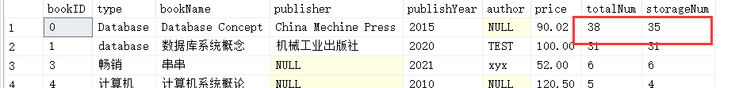
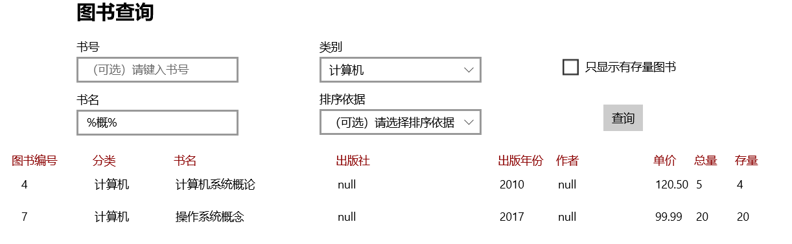

# Report

```SQL
use LibraryManager;

create table admin
(
	adminID		int not null,
	password	varchar(64) not null,
	name		varchar(32) not null,
	contact		varchar(64) not null,
	primary key (adminID)
);

create table books
(
	bookID		int not null,
    type		varchar(32),
    bookName	varchar(64) not null,
    publisher	varchar(64),
    publishYear	int,
    author		varchar(64),
    price		numeric(6, 2),
    totalNum	int not null,
    storageNum	int not null,
    primary key (bookID),
    check (totalNum >= storageNum),
    check (storageNum >= 0),
    check (price >= 0.0)
);

create table cards
(
	cardID		int not null,
    name		varchar(64) not null,
    department	varchar(64),
    type		varchar(32) not null,
    primary key (cardID)
);

create table records
(
	recordID	int not null,
    cardID		int not null,
    bookID		int not null,
    borrowDate	datetime,
    due			datetime,
    agentID		int not null,
    primary key (recordID),
    foreign key (cardID) references cards
    	on delete cascade
        on update cascade,
    foreign key (bookID) references books,
    foreign key (agentID) references admin
);
```

在 https://docs.microsoft.com/zh-cn/windows/uwp/design/controls-and-patterns/navigationview 学习侧边栏（导航视图） Navigation View 的使用

在 https://docs.microsoft.com/zh-cn/windows/uwp/design/style/segoe-ui-symbol-font 找到图标


```SQL
use LibraryManager;

insert into admin
	values (1, 'admin1', 'XYX', '15029757365'), (123, 'lc', 'LC', '0');
	
insert into books
	values (4, '计算机', '计算机系统概论', null, 2010, null, 120.5, 5, 0)
	
insert into records
	values (0, 0, 1, GETDATE(), DATEADD(DAY, 31, GETDATE()), 1)
```


页面结构：

* `MainPage.xaml` - 登录页面
* `AdminStatus.xaml` - 管理员状态页面
* `GuideLogin.xaml` - 引导登录页面
* `AddBook.xaml` - 图书入库页面
* `BookSearch.xaml` - 图书查询页面
* `LendBook.xaml` -  借书页面
* `ReturnBook.xaml` - 还书页面
* `CardManage.xaml` - 借书证管理页面


```
<NavigationView x:Name="NavView"
                         Loaded="NavView_Loaded"
                         ItemInvoked="NavView_ItemInvoked"
                         BackRequested="NavView_BackRequested" 
                         IsSettingsVisible="False"
                         IsBackButtonVisible="0"
                         Margin="0,0,0,0" FontFamily="Segoe UI"
                         >
            <NavigationView.MenuItems>
                <NavigationViewItem x:Name="AdminLogin" Tag="account" Icon="Contact" Content="管理员登录" HorizontalAlignment="Stretch" ScrollViewer.HorizontalScrollBarVisibility="Disabled" FontWeight="Normal" AccessKeyInvoked="AdminLogin_AccessKeyInvoked"/>
                <NavigationViewItemSeparator HorizontalAlignment="Stretch" Margin="5,5,0,0" VerticalAlignment="Stretch"/>
                <NavigationViewItem x:Name="BookNew" Tag="apps" Content="图书入库" FontFamily="Segoe UI">
                    <NavigationViewItem.Icon>
                        <FontIcon FontFamily="Segoe MDL2 Assets" Glyph="&#xECCD;"/>
                    </NavigationViewItem.Icon>
                </NavigationViewItem>
                <NavigationViewItem x:Name="BookSearch" Tag="games" Content="图书查询" FontFamily="Segoe UI">
                    <NavigationViewItem.Icon>
                        <FontIcon FontFamily="Segoe MDL2 Assets" Glyph="&#xF78B;"/>
                    </NavigationViewItem.Icon>
                </NavigationViewItem>
                <NavigationViewItem x:Name="Borrow" Content="借书">
                    <NavigationViewItem.Icon>
                        <FontIcon FontFamily="Segoe MDL2 Assets" Glyph="&#xEBE7;"/>
                    </NavigationViewItem.Icon>
                </NavigationViewItem>
                <NavigationViewItem x:Name="Return" Content="还书">
                    <NavigationViewItem.Icon>
                        <FontIcon FontFamily="Segoe MDL2 Assets" Glyph="&#xEC52;"/>
                    </NavigationViewItem.Icon>
                </NavigationViewItem>
                <NavigationViewItem x:Name="CardManage" Content="借书证管理" FontFamily="Segoe UI">
                    <NavigationViewItem.Icon>
                        <FontIcon FontFamily="Segoe MDL2 Assets" Glyph="&#xE716;"/>
                    </NavigationViewItem.Icon>
                </NavigationViewItem>
            </NavigationView.MenuItems>

            <ScrollViewer>
                <Grid x:Name="ContentFrame" Padding="0,0,12,24">
                    <TextBlock x:Name="Title" HorizontalAlignment="Left" Text="管理员登录" TextWrapping="Wrap" VerticalAlignment="Top" Margin="100,70,0,0" Height="35" Width="229" FontSize="24" FontWeight="Bold" SelectionChanged="TextBlock_SelectionChanged" FontFamily="Segoe UI"/>

                    <StackPanel>
                        <TextBox x:Name="AdminID" Width="300" Header="管理员 ID" PlaceholderText="请键入您的 ID" HorizontalAlignment="Left" Margin="100,160,0,0"/>
                        <PasswordBox x:Name="passwordBox" Width="300" MaxLength="16" Header="密码" PlaceholderText="请输入密码" Margin="100,40,0,0" HorizontalAlignment="Left" VerticalAlignment="Stretch"/>
                    </StackPanel>
                    <StackPanel>
                        <Button Content="登录" HorizontalAlignment="Left" VerticalAlignment="Top" Click="Button_Click" Margin="100,360,0,0"/>
                        <TextBlock x:Name="LoginTip" Margin="100,40,0,0" 
                                   HorizontalAlignment="Left" Text=""
                                   FontFamily="Segoe UI" FontSize="16" 
                                   VerticalAlignment="Stretch" Foreground="Red"/>
                    </StackPanel>
                    
                </Grid>
            </ScrollViewer>
        </NavigationView>
```

### 管理员登录

密码错误的提示：


密码正确则显示已登录：


### 图书入库

#### 单本入库

**模式 1：为已存在书目增加数量**


执行前后的数据库：





**模式 2：增加新的书目**


当出现不合法的输入时，弹窗进行提示：


#### 批量导入

单击选择文件，进入文件选区，选择文件后进行添加


添加成功后出现成功提示：


示例文件：

```
(111, 计算机, 计算机组成, xxx, 2004, xxx, 90.00, 2 )
(112, 计算机, Computer, xxx, 2004, xxx, 90.00, 5 )
(113, 计算机, Computer, null, 2020, 123, 15.10, 10)
(112, 计算机, Computer, xxx, 2004, xxx, 90.00, 5 )
(0, null, null, null, null, null, null, 5)
```

添加前：


添加后：


注意，文件中第 5 行使得 bookID 为 0 的数目增加了 5 本。


### 图书查询

#### 图书查询界面


#### 按书号查询


#### 按书名模糊查询


#### 复合查询




#### 将查询结果进行排列


### 借书


借书采用了和图书查询界面一样的查询功能，并增加了借阅功能。


输入借阅书号和借书证号，点击借阅，成功则提示：


随即刷新图书列表。


当所借阅的图书没有库存时，提示：


当所借阅的图书不存在时，提示：


其他错误提示（部分）：


借书记录将更新在 records 表中，并可以在还书、借书证管理模块进行查看。


### 还书

还书界面：


输入借书证号点击查询，可以看到对应的借书记录：


输入对应图书编号可以进行还书：


提示还书成功，同时 **只删除一条对应的还书记录**。


一些错误提示：


### 借书证管理

#### 注册借书证

输入信息后，进行注册并提示借书证编号：


#### 注销借书证

输入借书证编号进行注销：


**如果仍有未归还记录，不能注销：**

